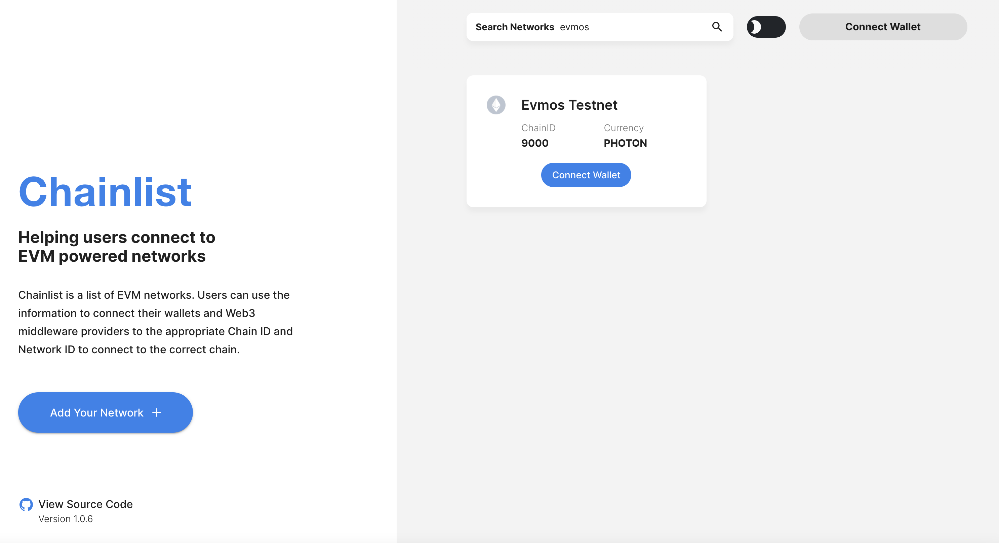

<!--
order: 1
-->

# Chain ID

Learn about the Teleport chain-id format {synopsis}

## Official Chain IDs

:::: tabs
::: tab Testnets

| Name                          | Chain ID                                                 | Identifier | EIP155 Number                                 | Version Number                                    |
| ----------------------------- | -------------------------------------------------------- | ---------- | --------------------------------------------- | ------------------------------------------------- |
| Teleport - Arsia Mons Testnet | `teleport_{{ $themeConfig.project.testnet_chain_id }}-1` | teleport   | `{{ $themeConfig.project.testnet_chain_id }}` | {{ $themeConfig.project.testnet_version_number }} |

:::
::: tab Mainnet

| Name                                               | Chain ID                                         | Identifier | EIP155 Number                         | Version Number                            |
| -------------------------------------------------- | ------------------------------------------------ | ---------- | ------------------------------------- | ----------------------------------------- |
| Teleport {{ $themeConfig.project.version_number }} | `teleport_{{ $themeConfig.project.chain_id }}-1` | teleport   | `{{ $themeConfig.project.chain_id }}` | {{ $themeConfig.project.version_number }} |
:::
::::

::: tip
You can also lookup the [EIP155](https://github.com/ethereum/EIPs/blob/master/EIPS/eip-155.md) `Chain ID` by referring to [chainlist.org](https://chainlist.org/).
:::



## The Chain Identifier

Every chain must have a unique identifier or `chain-id`. Tendermint requires each application to
define its own `chain-id` in the [genesis.json fields](https://docs.tendermint.com/master/spec/core/genesis.html#genesis-fields). However, in order to comply with both EIP155 and Cosmos standard for chain upgrades, Teleport-compatible chains must implement a special structure for their chain identifiers.

## Structure

The Teleport Chain ID contains 3 main components

- **Identifier**: Unstructured string that defines the name of the application.
- **EIP155 Number**: Immutable [EIP155](https://github.com/ethereum/EIPs/blob/master/EIPS/eip-155.md) `CHAIN_ID` that defines the replay attack protection number.
- **Version Number**: Is the version number (always positive) that the chain is currently running.
This number **MUST** be incremented every time the chain is upgraded or forked in order to avoid network or consensus errors.

### Format

The format for specifying and Teleport compatible chain-id in genesis is the following:

```bash
{identifier}_{EIP155}-{version}
```

The following table provides an example where the second row corresponds to an upgrade from the first one:

| ChainID           | Identifier | EIP155 Number | Version Number |
| ----------------- | ---------- | ------------- | -------------- |
| `teleport_8000-1` | teleport   | 9000          | 1              |
| `teleport_9000-2` | teleport   | 9000          | 2              |
| `...`             | ...        | ...           | ...            |
| `teleport_9000-N` | teleport   | 9000          | N              |
