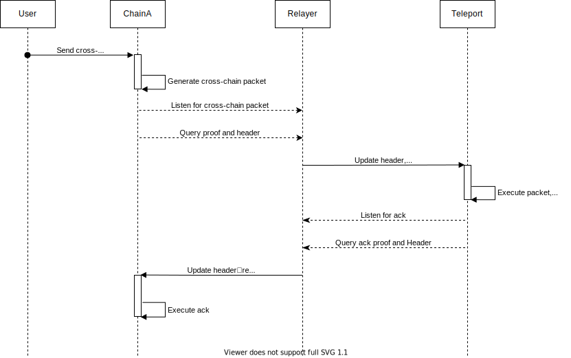
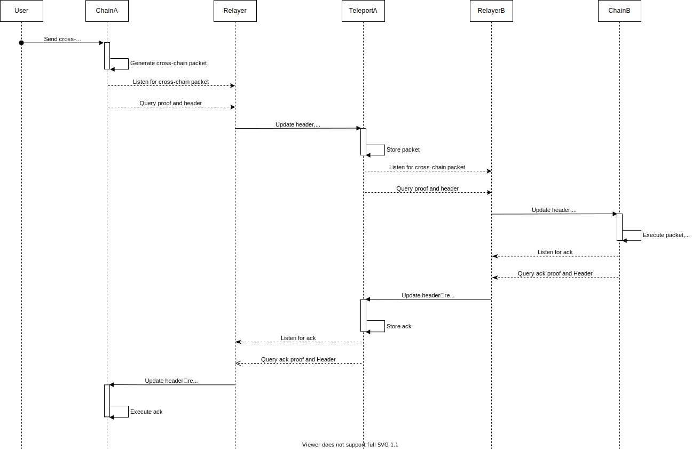

<!--
order: 0
title: "XIBC Overview"
parent:
  title: "XIBC"
-->

# `XIBC`

Teleport Extensible Inter-Blockchain Communication Protocol.

## Synopsis

XIBC is an extension of [IBC](https://ibcprotocol.org/). It is an interoperability protocol for communicating arbitrary data between arbitrary state machines, which can be used to build a wide range of cross-chain applications, including but not limited to token transfers, non-fungible token transfers and contract invocations. XIBC allows communications between any two chains via a third chain (e.g. Teleport Chain) trusted by both as a relay chain. 

### Advantages compared to IBC

* Source and destination chains only need to be connected to the relay chain
* Asset aggregation across different chains
* Better support for non-BFT consensus chains, e.g. Bitcoin and Ethereum
* Cross-chain interoperability for Smart Contracts
* Alternative cross-chain approaches such as `Light client` and `Multi-Party Threshold Signature`
* Clean-up data packets at the end of life cycle

### Features

* Secure, reliable cross-chain interoperability protocol based on cryptography
* Support seamless integration, arbitrary data cross-chain communication, atomic cross-chain contract invocation among homogeneous and heterogeneous chains
* Composable state verifications and applications
* Efficient and verifiable relay chain

## Components

### Client

XIBC clients are verification programs that are identified by a unique client id. XIBC clients track the consensus states of other blockchains and the proof specs of blockchains that are required to properly verify proofs against the client's consensus state. XIBC defines several basic client types: light client, [TSS client](./tss-spec.md), and ZK client, which can be combined with each other to verify any chain. The first batch of blockchains supported include:

* Bitcoin
* Ethereum
* Tendermint
* Avalanche
* Solona
* Polygon
* BSC
* Arbitrum

### Packet

#### Proof and Path

In XIBC, blockchains do not directly pass messages to each other over the network.

To communicate, a blockchain commits some state to a precisely defined path reserved for a specific message type and a specific counterparty. For example, a blockchain that stores a specific endpoint as part of a packet intended to be relayed to a contract on the counterparty chain.

A relayer process monitors updates to these paths and relays messages by submitting the data stored under the path along with a proof of the data to the counterparty chain.

#### Packet

Contracts communicate with each other by sending packets over XIBC ports. All XIBC packets contain:

* A sequence to optionally enforce ordering
* Source clientID
* Destination clientID
* Relay clientID
  
  If the relay chain is specified, it means the relay chain mode is used.

* A set of sub-packets. each packet contains:
  * PortID
    This port allows the contracts to know the receiver contract of a given packet.
  * Data

Contracts send custom application data to each other inside the `Data []byte` field of the XIBC sub-packet. Sub-packet data is completely opaque to XIBC handlers. The sender contract must encode their application-specific packet information into the Data field of packets; the receiver contract must decode that Data back to the original application data.

#### Receipt

XIBC writes a packet receipt for each sequence it has received. This receipt contains no information and is simply a marker intended to signify that the destination chain has received a packet at the specified sequence. This avoids the double spending issue.

#### Acknowledgements

Contracts also write application-specific acknowledgements when processing a packet. Acknowledgements can be done:

* Synchronously on `OnRecvPacket` if the contract processes packets as soon as they are received from XIBC contract.

* Asynchronously if the contract processes packets at some later point after receiving the packet.

This acknowledgement data is opaque to XIBC much like the packet Data and is treated by XIBC as a simple byte string `[]byte`. The receiver contracts must encode their acknowledgement so that the sender contact can decode it correctly.

The acknowledgement can encode whether the packet processing succeeded or failed, along with additional information that allows the sender contract to take appropriate action.

After the acknowledgement has been written by the receiving chain, a relayer relays the acknowledgement back to the original sender contract which then executes application-specific acknowledgment logic using the contents of the acknowledgement. This acknowledgement can involve rolling back packet-send changes in the case of a failed acknowledgement (refunding senders).

After an acknowledgement is received successfully on the original sender the chain, the XIBC contact deletes the corresponding packet commitment as it is no longer needed.

### Routing

Routing contract maintains the mapping between ports and basic applications, and routes each sub-packet(or sub-acknowledgement) to each basic application to execute their own logic.

#### Port

An XIBC basic application contract can bind to any number of ports. Each port must be identified by a unique portID. Since XIBC is designed to be secure with mutually-distrusted contracts that operate on the same ledger, binding a port returns the dynamic object capability. To take action on a particular port, for example, to send a packet with its portID, An XIBC basic application contract must provide the dynamic object capability to the XIBC handler.

XIBC contracts are for claiming the capability that is returned on `BindPort`.
### Basic applications

The cornerstone of application development based on the XIBC protocol. The module contains token-transfer, remote-contract-call and multi-contract-call, which can be directly adopted for cross-chain transactions or cross-chain dApps development

## Workflows

### Participating chain <--> relay chain



### Participating chain <--> participating chain



### Client updating

When the relayer observes that the dest chain client state is obsolete for cross-chain packet verification, it will fetch the appropriate client state from the source chain and send a transaction on dest chain to update the state.

Relayer

```text
                                                |
                                                | relayers relay the client state
                                                | from the counterparty chain
                                                v
                                        +-----------------+ 
                                        |                 |
                                        | Client Contract |
                                        |                 |
                                        |  update state   |
                                        |                 |
                                        +-----------------+ 
```

### Packet execution

#### SendPacket

Users can use XIBC basic contracts for cross-chain interoperability, such as cross-chain transfer and governance, or implement their own cross-chain operation contracts based on XIBC basic contracts.

```text
                                        +-----------------+ 
                                        |                 |
                                        |  User Contract  |
                                        |                 |
                                        |                 |
                                        +-----------------+ 
                                                 |
                                                 |  Developers can implement their own cross-chain operations
                                                 |  based on the XIBC basic contract
                                                 |
                                                 v
+----------------+  +----------------+  +-----------------+
|                |  |                |  |                 |
| ERC20-transfer |  | CrossChain-gov |  |  Contract-call  |
|                |  |                |  |                 |
|                |  |                |  | generate packet |
|                |  |                |  |                 |
+----------------+  +----------------+  +-----------------+
                                                 |
                                                 |
                                                 |
                                                 v
                                       +-------------------+ 
                                       |                   |
                                       |   PacketHandler   |
                                       |                   |
                                       |  save commitment, |
                                       |  generate event   |
                                       |                   |
                                       +-------------------+ 

```

#### Receive packet

```text
                                                |
                                                | Packet relayed from relayer that as
                                                | an observer of the counterparty chain
                                                v
                                      +--------------------+ 
                                      |                    |
                                      |    PacketHandler   |
                                      |                    |
                                      |   save receipt,    |
                                      |   handle packet,   |
                                      |  save ack  |
                                      |                    |
                                      +--------------------+ 
                                                |
                                                |
                                                |
                                                v
                                      +--------------------+ 
                                      |                    |
                                      |       Routing      |
                                      |                    |
                                      | loop packet, route |
                                      | sub-packets to XIBC|
                                      | basic contracts    |
                                      |                    |
                                      +--------------------+ 
                                                 |
                                                 | If any sub-package execution fails, 
                                                 | revert all state changes.
                                                 v
+----------------+  +----------------+  +-----------------+
|                |  |                |  |                 |
| ERC20-transfer |  | CrossChain-gov |  |  Contract-call  |
|                |  |                |  |                 |
|                |  |                |  |      excute     |
|                |  |                |  |    sub-packet   |
|                |  |                |  |                 |
+----------------+  +----------------+  +-----------------+
                                                 |
                                                 | 
                                                 |
                                                 v
                                        +-----------------+ 
                                        |                 |
                                        |  User Contract  |
                                        |                 |
                                        |                 |
                                        +-----------------+ 
```

#### Receive acknowledgement

```text
                                                |
                                                | Acknowledgement relayed from relayer that as
                                                | an observer of the counterparty chain
                                                v
                                      +--------------------+ 
                                      |                    |
                                      |    PacketHandler   |
                                      |                    |
                                      |    handle ack,     |
                                      | delete commitment  |
                                      |                    |
                                      |                    |
                                      +--------------------+ 
                                                |
                                                |
                                                |
                                                v
                                      +--------------------+ 
                                      |                    |
                                      |       Routing      |
                                      |                    |
                                      |  loop ack, route   |
                                      |  sub-acks to XIBC  |
                                      |  basic contracts   |
                                      |                    |
                                      +--------------------+ 
                                                 |
                                                 | If any sub-package execution fails, 
                                                 | revert all state changes.
                                                 v
+----------------+  +----------------+  +-----------------+
|                |  |                |  |                 |
| ERC20-transfer |  | CrossChain-gov |  |  Contract-call  |
|                |  |                |  |                 |
|                |  |                |  |      excute     |
|                |  |                |  |      sub-ack    |
|                |  |                |  |                 |
+----------------+  +----------------+  +-----------------+
                                                 |
                                                 | 
                                                 |
                                                 v
                                        +-----------------+ 
                                        |                 |
                                        |  User Contract  |
                                        |                 |
                                        |                 |
                                        +-----------------+ 
```

## Relayer Incentivisation

The relay process must have the access to accounts on both chains with sufficient balance to pay for transaction fees, in order to ensure the forward flow of cross-chain data packets, incentivisation is necessary.

A user can specify a cross-chain fee for the packet. Once the acknowledgement is sent back to the source chain, the relayer will get the fee.

## Exception Handling

It can be considered that sufficient cross-chain transaction fees paid to relayers will positively motivate cross-chain operations to be actively executed. When a user finds his cross-chain transaction has not been executed in time, he may increase transaction fees to accelerate. However, XIBC allows users to specify other packet sequences without adding extra transaction fees. 


## Technical Specification

### Definitions

#### Client inteface

```solidity
interface Client {
    // status returns the status of the current client
    function status() external view returns (Status);

    // latestHeight returns the current latest height of the client
    function latestHeight() external view returns (Height.Data memory);

    // initializeState initializes the client state.
    function initializeState(
        bytes calldata clientState,
        bytes calldata consensusState
    ) external;

    // checkHeaderAndUpdateState checkes the header and update clientState, consensusState
    function UpdateState(address caller, bytes calldata header)
        external;

    // upgradeState upgrades the client to a new client state.
    function upgradeState(
        address caller,
        bytes calldata clientState,
        bytes calldata consensusState
    ) external;

    // verifyPacketCommitment verifies the commitment of the cross-chain data packet
    function verifyPacketCommitment(
        address caller,
        Height.Data calldata height,
        bytes calldata proof,
        string calldata sourceChain,
        string calldata destChain,
        uint64 sequence,
        bytes calldata commitmentBytes
    ) external view;

    // verifyPacketAcknowledgement verifies the acknowledgement of the cross-chain data packet
    function verifyPacketAcknowledgement(
        address caller,
        Height.Data calldata height,
        bytes calldata proof,
        string calldata sourceChain,
        string calldata destChain,
        uint64 sequence,
        bytes calldata acknowledgement
    ) external view;
}
```

#### Packet

```protobuf
message Packet {
    // number corresponds to the order of sends and receives, where a Packet
    // with an earlier sequence number must be sent and received before a Packet
    // with a later sequence number.
    uint64 sequence = 1;
    // identifies the chain id of the sending chain.
    string source_chain = 2;
    // identifies the chain id of the receiving chain.
    string destination_chain = 3;
    // identifies the chain id of the relay chain.
    string relay_chain = 4;
    // identifies the ports on the sending chain and destination chain
    repeated string ports = 5;
    // actual opaque bytes transferred directly to the application module
    repeated bytes data_list = 6;
}
```

#### Acknowledgement

```protobuf
message Acknowledgement {
    // the execution results of the packet data list
    repeated bytes results = 1;
    // error message
    string message = 2;
}
```

#### Routing

```solidity
contract Routing {
    // Mapping for Port:Application
    mapping(string => IModule) public apps;
}
```

#### Application interface

```solidity
interface IModule {
    // onRecvPacket handles the sub packet
    // Must return the acknowledgement bytes
    // In the case of an asynchronous acknowledgement, nil should be returned.
    function onRecvPacket(bytes calldata data)
        external
        returns (PacketTypes.Result memory result);
    
    // onAcknowledgementPacket handles the acknowledgement packet
    function onAcknowledgementPacket(bytes calldata data, bytes calldata result)
        external;
}
```

### Core pseudocode

#### Packet handler

```solidity
// PacketHandler handles incoming or outgoing data packets
contract PacketHandler {
    IRouting routing;
    // Commitments are used to provide the proof of packet and acknowladgement with different prefix
    mapping(bytes => bytes32) public commitments;
    // Receipts are used to avoid replay attacks 
    mapping(bytes => bool) public receipts;
    
    function sendPacket(Packet calldata packet) external {
        abortTransactionUnless(packet.sequence = nextSequence);
        for (uint256 i = 0; i < packet.datas.length; i++) {
            abortTransactionUnless(checkPort(packet.datas[i].port));
        }
        commitments[getPacketCommitmentKey(packet)] = sha256(abi.encode(packet));
        emit packetEvent(packet);
    }

    function recvPacket(Packet calldata packet, bytes calldata proof) external {
        bytes memory packetReceiptKey = getPacketReceiptKey(packet)
        abortTransactionUnless(receipts[packetReceiptKey] == false);
        verifyPacketCommitment(packet, proof);
        try routing.routePacket(packet) returns (bytes[] results) {
            commitments[getPacketAcknowledgementKey(packet)] = sha256(abi.encode(results)); // success ack
        } catch (bytes memory error) {
            commitments[getPacketAcknowledgementKey(packet)] = error; // failure ack
        }
        receipts[packetReceiptKey(packet)] = true;
    }

    function recvAck(Acknowledgement memory ack) external {
        try routing.routeAck(ack) returns (bytes[] results) {
            deleteCommitment(ack.sequence);
        } catch (bytes memory error) {
            // TBD: always delete commitment
            revert("failed to handle ack");
        }
    }
}

// Routing routes each sub-packet to corresponding module
// If it fails, revert all state changes 
contract Routing {
    mapping(uint8 => IApp) routes;

    function routePacket(Packet memory packet) public returns (bytes[] results) {
        for (uint256 i = 0; i < packet.datas.length; i++) {
            Data memory data = packet.datas[i];
            try routes[data.port].recvPacket(packet, i) {
                ack.results[i] = 0x00;
            } catch (bytes memory) {
                revert("failed to execute raw data");
            }
        }
    }

    function routeAck(Acknowledgement memory ack) public returns (bytes[] results) {
        Packet memory packet = getPacket(ack.sequence);
        for (uint256 i = 0; i < packet.datas.length; i++) {
            Data memory data = packet.datas[i];
                try routes[data.port].recvAck(packet, i, ack.results[i], ack.error) {
                
                } catch (bytes memory) {
                    revert("failed to execute ack");
                }
        }
    }
}
```

#### XIBC basic contracts

```solidity
// IApp implementation: ERC20 cross-chain transfer
contract CrossChainTransfer is IApp {
    IPacketHandler packetHandler;
    
    struct ERC20TransferData {
        string srcChain;
        string destChain;
        string sender;
        string receiver;
        bytes amount;
        string token;
        string oriToken;
    }
    
    function sendCrossChainTransfer(address tokenAddress, address receiver, uint256 amount, 
        string destChain, string relayChain) public {
        if isOutGoing(tokenAddress) {
            // send to the outgoing chain, lock token
            IERC20(transferData.tokenAddress).transferFrom(
                msg.sender,
                address(this),
                transferData.amount
            );
        } else {
            // send back to origin chain, burn token
            IERC20XIBC(tokenAddress).burnFrom(msg.sender, amount);
        }
        ERC20TransferData data = wrapData(tokenAddress, receiver, msg.sender, amount, destChain, relayChain);
        Packet packet = wrapPacket(data);
        packetHandler.sendPacket(packet);
    }

    function onRecvPacket(bytes calldata packetData) external {
        ERC20TransferData memory transferData = abi.decode(
            packetData,
            (ERC20TransferData)
        );
        address tokenAddress = tokenBindingTraces(packetData)
        if isOutGoing(tokenAddress) {
            // receive in the outgoing chain, mint token
            IERC20XIBC(packetData.).mint(to, amount)
        } else {
            // receive in the origin chain, unlock token
            IERC20(packetData.oriToken.parseAddr()).transfer(
                packetData.receiver.parseAddr(),
                packetData.amount.toUint256()
            );
        }
    }

    function onAcknowledgementPacket(bytes calldata packetData, bytes calldata result) external {
        ERC20TransferData memory transferData = abi.decode(
            packetData,
            (ERC20TransferData)
        );

        if (err.length > 0) {
          // Refund token to sender address
          IERC20(transferData.tokenAddress).transfer(
              transferData.sender,
              transferData.amount
          );          
        } else {
          // Successful acknowledgement execution logic
          // Do nothing
        } 
    }
}

// IApp implementation: cross-chain contract call
contract CrossChainConractCall is IApp {
    IPacketHandler packetHandler;
    
    struct RCCData {
        address contractAddress;
        bytes data;
        string destChain;
        string relayChain;
    }
    
    function sendRemoteContractCall(address contractAddress, byte32 data, string destChain, string relayChain) public {
        ConractCallData data = wrapData(contractAddress, args, destChain, relayChain);
        Packet packet = wrapPacket(data);
        packetHandler.sendPacket(packet);
    }

    function onRecvPacket(bytes calldata packetData) external {
        RCCData memory rccData = abi.decode(
            packetData,
            (ConractCallData)
        );
        
        packetData.contractAddress.call(packetData.data);
    }

    function onAcknowledgementPacket(bytes calldata data, bytes calldata result) external {
        acks[sha256(data)] = result;
        emit Ack(sha256(data), result);
    }
}
```

## Usage Scenarios

XIBC protocol supports multiple status verifications and composable applications, which can be used for any interoperability between chains. You can check some practices [here](./examples.md).
