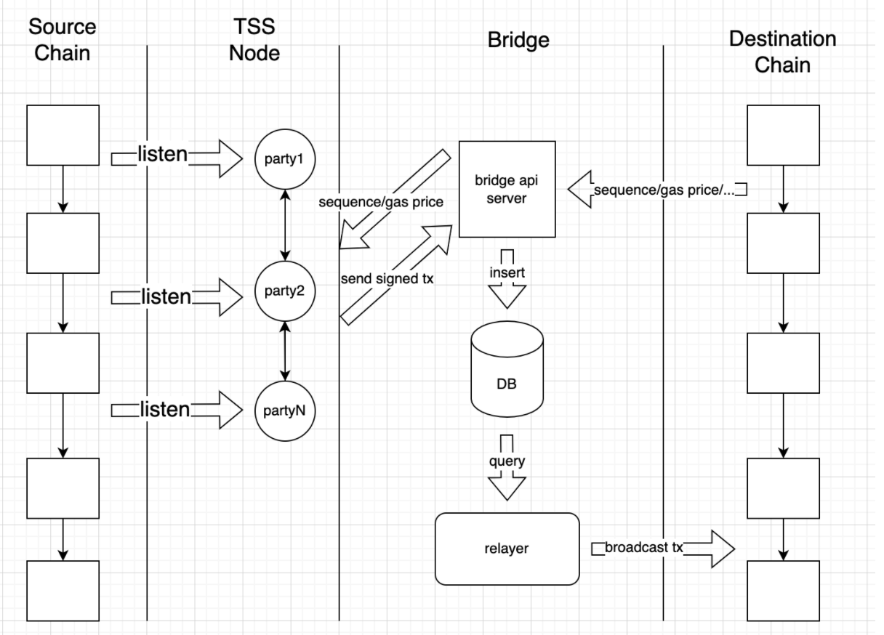
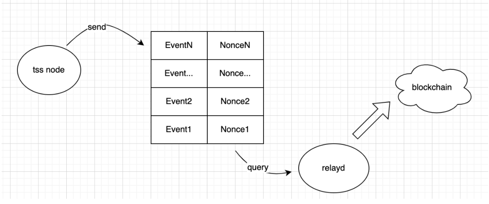
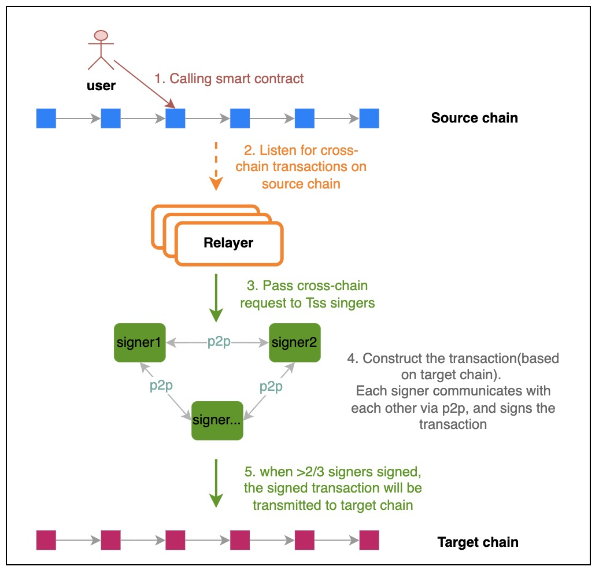
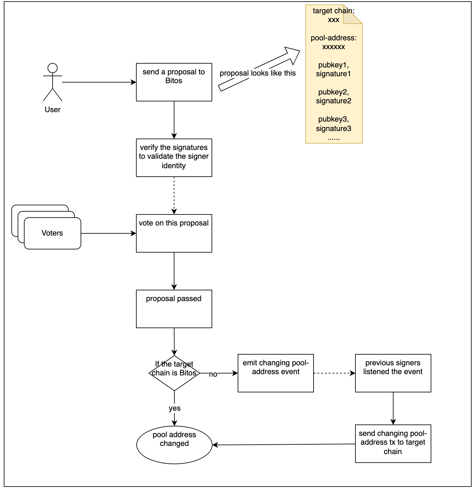

# TSS cross-chain spec

## `Overview`

TSS stands for Threshold Signature Scheme, which is a digital signature scheme based on
a branch of public key cryptography and threshold cryptography. TSS is a cryptographic protocol for distributed key generation and signing.
We use this cryptographic technique for multi-party validation of the cross-chain transactions and events. It provides an approach to generate a signature that signed by multiple participants without exposing the private key of each party.

## `Architecture`

The above diagram illustrates the architecture of the TSS cross-chain validation service. The service has two main modules, the TSS Node and the Bridge, which work closely together to accomplish the validation of cross-chain transactions and events based on the Tss protocol.

### `TSS Node`

The TSS Node is  responsible for

1. listening for the cross-chain events on source chain
2. generating the signature of the cross-chain transaction by executing TSS process
3. sending the signed transaction to the Bridge

#### `Transaction Construction`
To construct a cross-chain transaction signed by `TSS` algorithms, we need the majority of `TSS` nodes to agree on the related event from the source chain. Each tss node obtains the events from the source chain as an observer. Once it gets the matched event, it will start the tss signing process via p2p connection with each other.

We presume that most of the nodes are honest, so it is impossible that a fake event can be detected by most of the tss nodes.

Each tss node needs to wrapper an identical transaction(the message to be signed), including message content and other parameters, such as  nonce, gas price, gas limit etc. To provide identical transaction parameters, we introduce the bridge-api server, which ensures that all the tss nodes can get the same transaction parameters for a specified cross-chain event.

Let’s take an example of getting gas price, the server caches the suggested gas price for the specified transaction, and the tss nodes will always get the same gas price within the cache period.

### `Bridge`

The bridge service is designed to

1. provide the transaction parameters to TSS node,such as account nonce, gas price, max gas limit etc.
2. broadcast the signed transaction to the destination chain.

#### `Relay`

The bridge service receives transactions from tss nodes, and stores them into the DB. And have another daemon process named ‘relayd’ that will query the transactions from DB, and send them to blockchain in order.
#### `Transaction Build Helper`
Besides, the bridge service enables the tss nodes to construct an identical transaction based on the same event, in order to coordinate signature generation. So it also works as a

**Nonce Provider**

Each time the tssnode asks for the nonce of the address, the bridge-api returns N+1 as the nonce, which results in each tss node needing to handle the same event at an approximate time

**Gas Params Provider**

The bridge service caches the gas parameters(price, limit etc) for delivering an specified event for several minutes, and always provides the same values to each tss node during cache period
#### `Transaction Result Wrapper`
It wraps the transaction result of being executed on blockchain. The tss nodes need to manage the event lifecycle according to the corresponding transaction result the bridge returns.

The transaction starts with ‘initialized’ status, and ends with various kinds of results. The event lifecycle finishes only when the corresponding transaction is successfully delivered on the blockchain. Otherwise, tss nodes need to rebuild transactions for it until it succeeds.

## `Workflow`

The above diagram illustrates the procedure of the cross-chain transcations from calling smart contract in source chain to transmitting the transaction in target chain.
The procedure generally consists of five steps: call smart contract, listen for transaction, pass cross-chain request, construct the transaction in target chain and verify the validation of transaction in target chain.

Then, let’s take a more detailed look at the major steps of cross-chain transcations with validation via TSS.

### `Calling smart contract`

When a user decides to initiate one or more cross-chain transactions, they do so by calling a smart contract on the source chain. Or, when a user calls a smart contract on the source chain, that smart contract may generate cross-chain transactions on the source chain.

Regardless of the method, once a cross-chain transaction is generated on the source chain, it is possible that the transaction will be listened to by the relayers in the next step.

### `Listening for cross-chain transaction`
In this step, relayers, a part of bridge service, listen for cross-chain transaction on source chain. After listening to a cross-chain transaction, the relayer collects the information of this transaction, and prepare for the follow-up steps.

### `Passing the cross-chain request`

After collecting the information of cross-chain transaction, the relayers will pass the cross-chain request with those data to TSS signers. As we have described before, there are many TSS signers which are the tss nodes in the architecture of the TSS cross-chain validation service.

### `Constructing the correlated transaction`

After getting the information of transaction in source chain, the TSS signers will construct the new transaction based on the target chain. In this step, the process of signing the transaction by the signing algorithm of TSS is most critical.

All the signers should construct the transaction with totally identical parameters, including message body, gas price, gas limit, etc.

### `Verifying the validation of new transaction`
The signature will be verified by the signature verifying algorithm of TSS. and the threshold of the signature will be Two-thirds of the number of all TSS signers.
Thus, the transaction must be signed by more than 2/3 TSS signers, then the transaction will be transmitted to target chain, otherwise, the cross-chain transaction do not pass the signautre verification and cannot be accept by the target chain.

## `Changing Signer`

The participant of the `TSS` has the chance to exit or join. That means we need to regenerate the address(for verifying the signature, we call it pool address below) when the TSS members are changed, and the process of changing address must be safe and smooth.

1. Users send a proposal to Teleport Chain, the proposal includes the pool address(calculated by the new tss members group), each tss member's public key and their signatures
2. Teleport firstly verifies the signatures to check the tss members identity, if fails, reject the proposal
3. Identity check pass, the proposal will be posted on chain. The voters from the Teleport community will vote on this proposal
4. The proposal will be passed when more than 2/3 voting power of voters approve this proposal.
5. If the target chain is Teleport, then directly change the pool address. If not, it will emit the event
6. The relayers of target chain(basically the previous group of tss members) will listen to this event, and relay the message to target chain to change the pool address.

