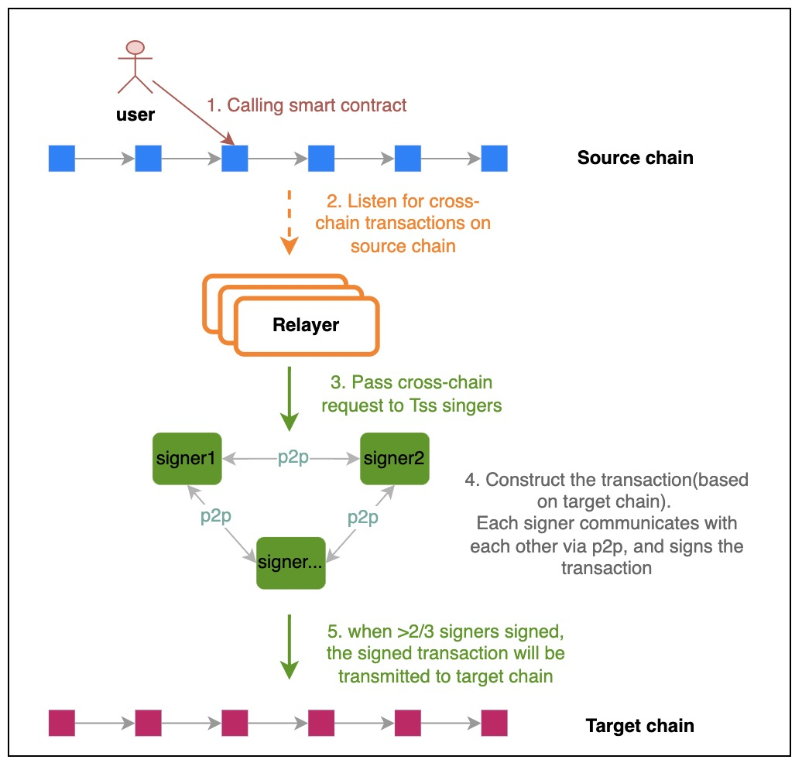

# `MPC`

`MPC` stands for Secure Multi-Party Computation. It is used to verify the cross-chain transactions by the agreement of multiple parites.  

## `Approach`

### `TSS`

`TSS` stands for Threshold Signature Schema. We use it for the MPC validation. It provides an approach to generate a signature that signed by multiple participants without exposing the private key of each party.

The picture above illustrates the process of the cross-chain transactions being acted via MPC validation. Multiple participants will be employed as the TSS signer, and they are responsible for verifying the cross-chain events happening on the source chain. Each signer holds its own private key share, and the valid signature only can be generated when more than ⅔ signers sign the transaction.

### `Change Signers`

The participant of the `TSS` has the chance to exit or join. That means we need to regenerate the address(for verifying the signature, we call it pool address below) when the TSS members are changed, and the process of changing address must be safe and smooth.

1. Users send a proposal to Teleport Chain, the proposal includes the pool address(calculated by the new tss members group), each tss member's public key and their signatures
2. Teleport firstly verifies the signatures to check the tss members identity, if fails, reject the proposal
3. Identity check pass, the proposal will be posted on chain. The voters from the Teleport community will vote on this proposal
4. The proposal will be passed when more than 2/3 voting power of voters approve this proposal.
5. If the target chain is Teleport, then directly change the pool address. If not, it will emit the event
6. The relayers of target chain(basically the previous group of tss members) will listen to this event, and relay the message to target chain to change the pool address.
